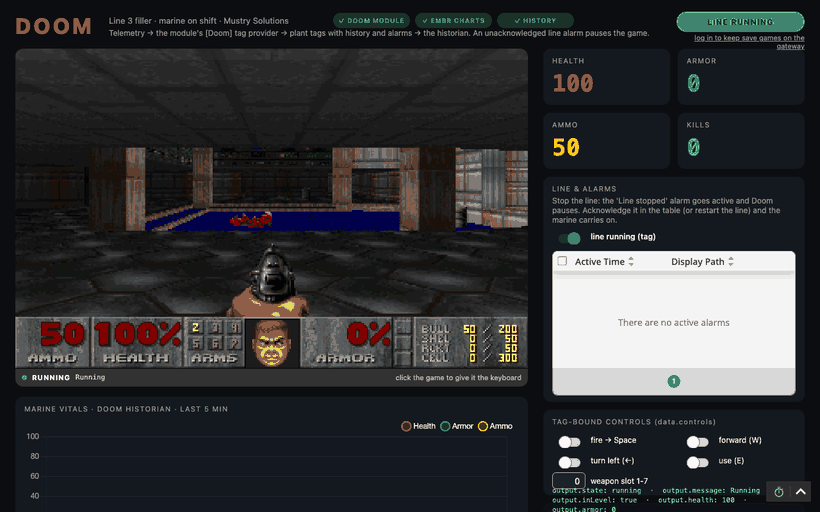
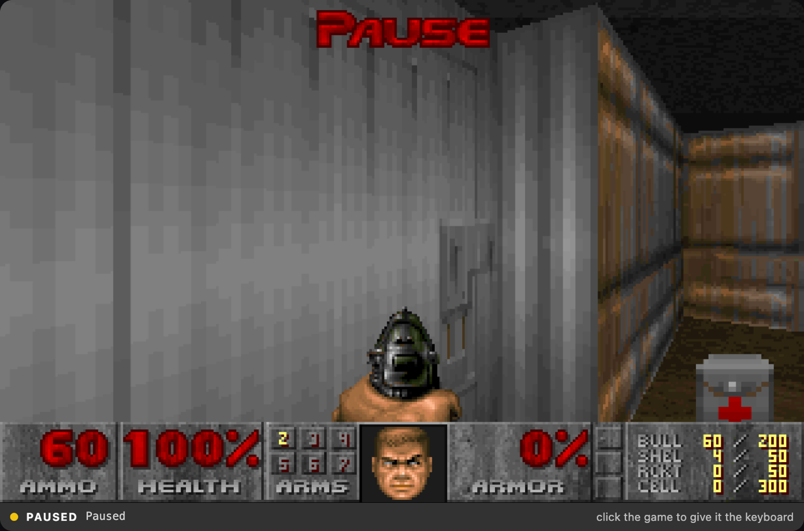
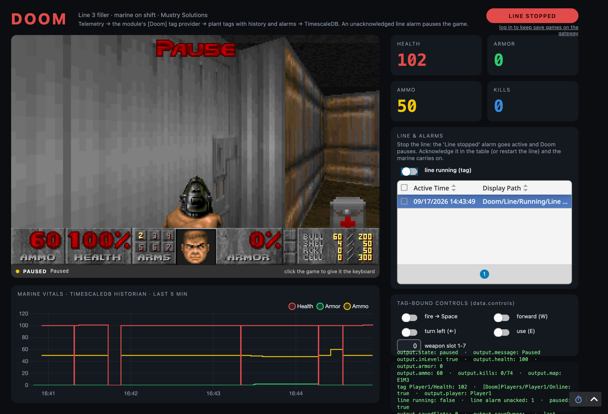
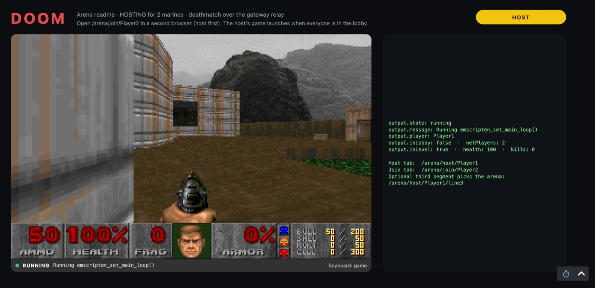
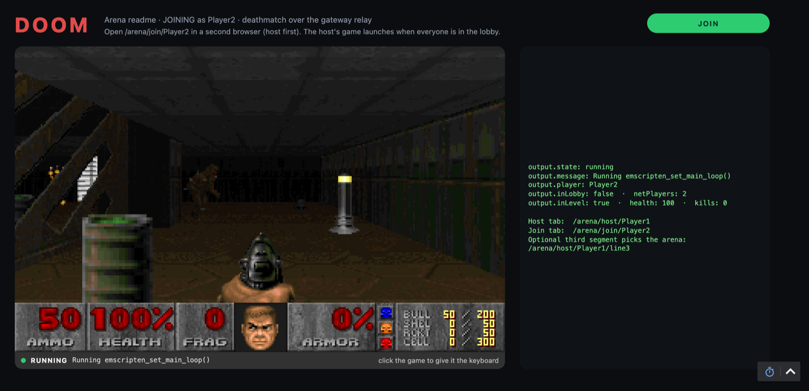
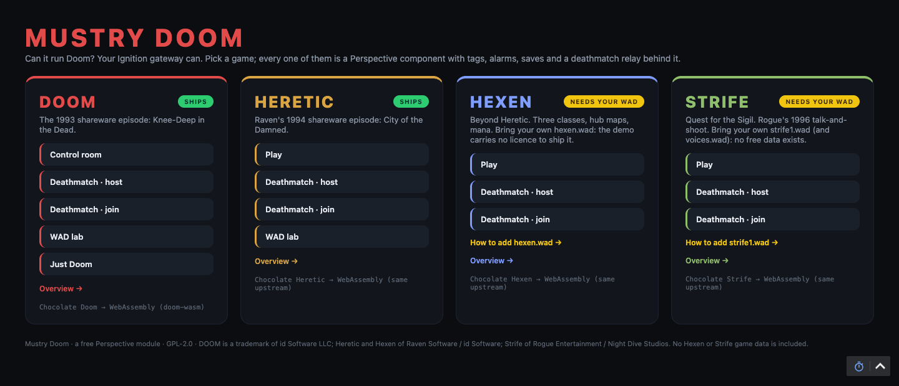
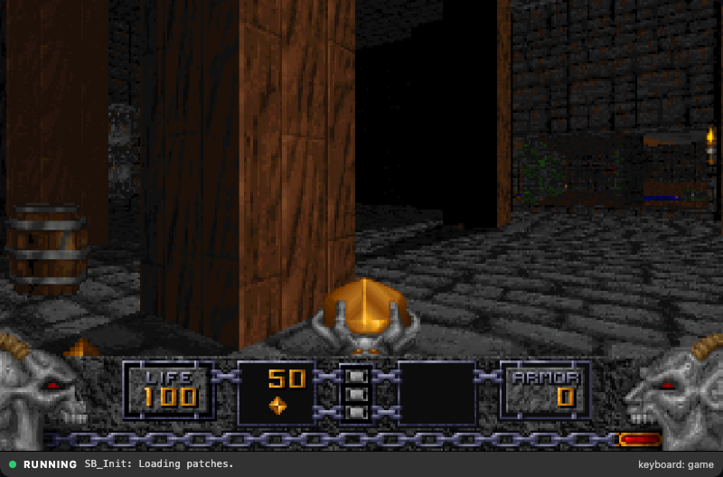
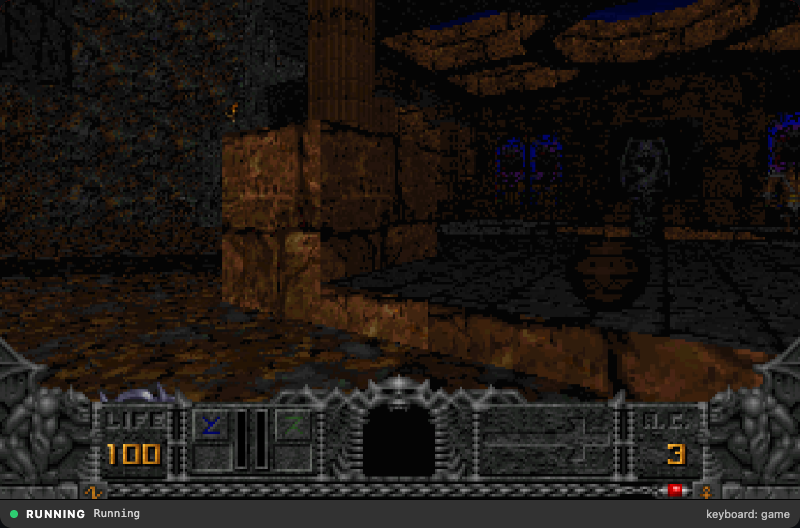
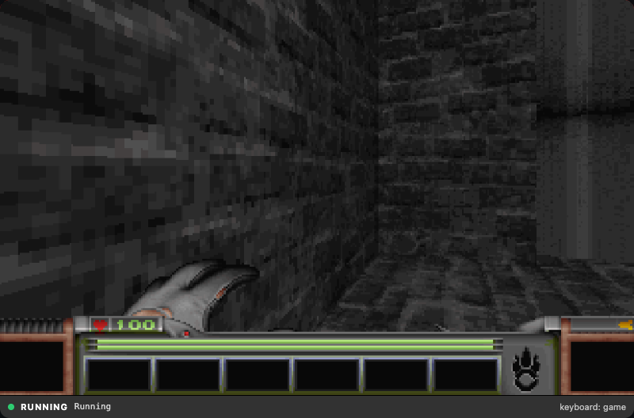
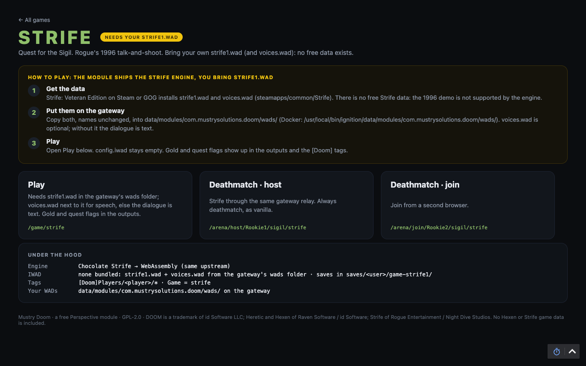

# Mustry Doom

**Can it run Doom? Your Ignition gateway can.**

A free Perspective component that runs Doom inside your SCADA. And Heretic.
And, with your own data, Hexen and Strife: the whole Chocolate Doom family
in one component. Tags fire the shotgun. Alarms pause the game. The marine's
health lands in your historian next to the pump pressures. Two operators can
deathmatch each other through the gateway.

It is of no industrial value whatsoever. That is the point.



*Ten seconds of the demo project. A tag toggle turns the marine and fires the
shotgun; stopping the line raises an alarm, and `state.paused` freezes the
game until someone acknowledges it. The trend is the marine's health, in a
real historian.*

- Ignition **8.3.6+**, Perspective
- One component: `Doom`, under the `Mustry Solutions` palette category.
  `config.game` picks Doom, Heretic, Hexen or Strife.
- Doom and Heretic ship with their shareware episodes; Hexen and Strife ship
  as engines for the `hexen.wad` / `strife1.wad` you own ([how](#playing-hexen-and-strife-bring-your-own-wad)).
- Free, no trial, no activation. GPL-2.0.

Made by [Mustry Solutions](https://mustrysolutions.com?utm_source=github&utm_medium=readme&utm_campaign=doom),
a Belgian IT/OT consultancy that builds Ignition systems and modules. See
[Built by Mustry Solutions](#built-by-mustry-solutions).

---

## What it does

**Plays Doom.** Drag the component into a view, save, click. The engine is
Chocolate Doom compiled to WebAssembly, served by the gateway, running in the
browser. Keyboard and mouse work when the game has focus and never leak into
the rest of your view. The other three games are the same engine family
built the same way, behind `config.game`.

**Takes orders from tags.** Every control is a boolean prop: `forward`,
`turnLeft`, `fire`, `use`, and the rest. Bind them to tags and a PLC input
fires the shotgun. A weapon slot prop switches guns on change.

**Obeys your alarms.** `state.paused` is two-way. Bind it to an active alarm
and production trouble freezes the marine until someone acknowledges. Doom
shows its own pause banner.

**Reports back.** Health, armor, ammo, weapon, kills, secrets, map, level
time, alive or dead: the component streams its telemetry to the gateway and
the module writes it into its own `[Doom]` tag provider, one folder per
player. No bindings, no scripts. Historize it, alarm on it, trend it.

**Remembers.** Doom's six save slots are stored on the gateway per Perspective
user. Save on the day shift, load on the night shift. Sessions without a login
keep their saves in the tab, so nobody shares a folder by accident.

**Deathmatch.** The gateway relays Doom's network between Perspective
sessions. Host in one browser, join from another. The host's game launches
when everyone is in the lobby. Only sessions running the component get into
an arena: the gateway hands each one a ticket.

**Four games, one component.** `config.game = heretic` runs Raven's 1994
shareware episode: same controls, same tags, same saves, same deathmatch
relay, elven wand instead of pistol. `hexen` and `strife` run Hexen and
Strife from the `hexen.wad` or `strife1.wad` (plus `voices.wad`) you own,
placed in the gateway's wads folder: the module ships those engines and not
their data (Hexen's demo grants no redistribution; Strife has no free data).
`config.playerClass` picks fighter, cleric or mage; Strife reports gold and
quest flags. Their pages in the demo project say **NEEDS YOUR WAD** until
the file is there, and show how to get it.

---

## In pictures

The demo project from the releases page, running on a plain 8.3.6 gateway
with the Mustry TimescaleDB Historian and Embr Charts installed. The module
provides the game and the tags; the screen around them is this project.



*Line 3 stopped. The alarm is unacknowledged. The marine waits.*

![The control room: the game, health/armor/ammo/kills tiles fed by the [Doom] tag provider, the line alarm table, tag-bound controls and a five-minute health trend from the historian.](docs/images/control-room.png)

*The control room. Tiles and chart are ordinary tags: the component writes
its telemetry into the module's own `[Doom]` provider and the plant side
mirrors it with history and alarms. The three pills in the header are the
requirements check: this gateway has the module, Embr Charts and a historian.*



*Someone stopped line 3. The alarm went active, `state.paused` followed it,
and the marine stopped mid-corridor. Acknowledge the alarm and he carries on.*

| Host | Joiner |
|---|---|
|  |  |

*Two Perspective sessions, one arena, relayed by the gateway. Note the status
bar: FRAG where ARMS used to be, and two player markers.*



*The demo project's front door. Every card is the same component with a
different `config.game`; the two on the right wait for a WAD you own.*

| Heretic | Hexen | Strife |
|---|---|---|
|  |  |  |

*The rest of the family. Heretic's shareware episode ships in the module;
Hexen and Strife run from the operator's own data.*



*What a data-less game looks like before you add its WAD: the page explains
where the file comes from and where it goes.*

---

## Install

1. Download `Mustry-Doom.modl` from the [releases page](https://github.com/Mustry-Solutions/ignition-doom-module/releases).
2. Gateway, Config, Modules, install. Accept the certificate and the licence.
3. Designer: drag **Doom** from the palette into a view. Save. Open the
   session. Click to play.

That is the whole setup. Nothing else to configure.

**What the module gives you:** the component, four engines, the Doom and
Heretic shareware episodes served by the gateway, the `[Doom]` tag provider
that fills itself with each player's telemetry, save games per user, and the
deathmatch relay. All of it works from a bare component with default
settings; Hexen and Strife additionally want their WAD on the gateway.

**What it does not give you:** the control-room screen in the pictures
above. That is a demo project, and it is one download away.

### The demo project

Every release also carries `Mustry-Doom-Demo-Project.zip`. In the Designer,
File, Import, pick the zip, import everything. You get project `DoomDemo`
with a launcher at `/` that lists every game and its pages: the Doom
control room at `/doom/control-room`, the deathmatch arena at
`/arena/host/<player>` and `/arena/join/<player>`, `/wad/<iwad>` for a WAD
of your own, `/game/<game>` for each game, and an overview per game at
`/doom`, `/heretic`, `/hexen` and `/strife` (the last two with the
bring-your-own-WAD how-to). The tags it uses are created the first time a
view opens.

**The full experience needs three things.** Two of them are optional, and
the view tells you which ones it found: three pills in the header, green when
the piece is there and grey when it is not. Hover one for what to do.

| Piece | What it adds | Where |
|---|---|---|
| **Mustry Doom** module | The game, the `[Doom]` tags, save games, deathmatch. Everything except the trend. | This repo's [releases](https://github.com/Mustry-Solutions/ignition-doom-module/releases) |
| **Embr Charts** (optional) | Draws the five-minute vitals trend. | Musson Industrial's [releases](https://github.com/mussonindustrial/embr/releases): the `Embr-Charts-Ignition83` file. Free, MIT. |
| A **tag history provider** (optional) | Data for the trend. The demo enables history on its tags when it finds one. | Any historian. We use the [Mustry TimescaleDB Historian](https://github.com/Mustry-Solutions/timescaledb-historian-module) (needs a PostgreSQL/TimescaleDB database). |

Without the optional two, the chart card says which one is missing and the
rest of the page works. Add them later and reload the page: the tags pick up
history on the next open.

---

## Five minute tour

**Pause on alarm.** Bind `state.paused` to your line's alarm state:

```
{[default]Line3/Running.AlarmActiveUnackCount} > 0
```

**Fire from a tag.** Bind `data.controls.fire` to any boolean tag. True holds
the trigger, false releases it.

**Historize the marine.** Enable history on `[Doom]Players/<player>/Health`
in the Designer. Done. It trends like any process value.

**Alarm on death.** Put a Critical alarm on `[Doom]Players/<player>/Dead`.
Label it "Marine down". Watch the alarm table light up.

**Deathmatch.** Set `config.multiplayer` to `host` on one component and
`join` on another, same `config.arena`. Open both sessions. Fight.

**Bring your own WAD.** Copy the `DOOM2.WAD` (or `HERETIC.WAD`) you own into
`data/modules/com.mustrysolutions.doom/wads/` on the gateway and set
`config.iwad` to `doom2`. Mods go next to it and into `config.pwads`. Only
sessions running the component can fetch them; everyone else gets a 403.

---

## Playing Hexen and Strife: bring your own WAD

The module ships those two engines but not their data, so they show
**NEEDS YOUR WAD** in the demo project until you supply it. Three steps:

1. **Get the data.** Hexen: *Hexen: Beyond Heretic* on Steam or GOG installs
   `hexen.wad`; the free 4-level demo works too (`hexndemo.zip` on the
   idgames archive, `HEXEN.WAD` inside). Strife: *Strife: Veteran Edition*
   on Steam or GOG installs `strife1.wad` and `voices.wad` under
   `steamapps/common/Strife`. There is no free Strife data.
2. **Put it on the gateway**, name unchanged, in
   `data/modules/com.mustrysolutions.doom/wads/` (Docker image:
   `/usr/local/bin/ignition/data/modules/com.mustrysolutions.doom/wads/`).
   No restart: the component asks the gateway what is there every time it
   starts. `voices.wad` is optional; without it Strife's dialogue is text.
3. **Play.** Set `config.game` to `hexen` or `strife`, leave `config.iwad`
   empty. The demo project's game page has the same steps and a Play button.

| Game | File(s) | Where it comes from |
|---|---|---|
| Hexen | `hexen.wad` | Steam/GOG, or the free 4-level demo |
| Strife | `strife1.wad`, `voices.wad` (optional) | Steam/GOG only |
| Doom, free and complete | `freedoom1.wad`, `freedoom2.wad` | [Freedoom](https://freedoom.github.io/) (BSD licence) |

**Mods without buying Doom II.** The shareware episode refuses PWADs (the
engine's "Register!" rule), and registered IWADs are not free. Freedoom is:
a complete, free Doom-compatible game. Put `freedoom2.wad` in the wads
folder, set `config.iwad` to `freedoom2` and `config.pwads` to your map
pack, and it loads. `ops/fetch-freedoom.sh` gets the pinned release for the
dev gateway; on a real gateway, download it from the Freedoom site.

The data stays on your gateway, is never uploaded anywhere, and is served
only to Perspective sessions running the component (ticketed; anyone else
gets a 403).

---

## Where the data lives

| Data | Where |
|---|---|
| Live telemetry | `[Doom]Players/<player>/*`, the module's own tag provider |
| Save games | `data/modules/com.mustrysolutions.doom/saves/<user>/` on the gateway; other games and custom IWADs in `game-<iwad>/` under it |
| Deathmatch traffic | Relayed by the gateway at `/system/doom-relay/<arena>`, never stored |
| The game itself | Runs in the browser tab. The gateway serves the engines and the two shareware WADs. |
| Your own WADs | `data/modules/com.mustrysolutions.doom/wads/` on the gateway, served to component sessions only |

The player name defaults to the session's authenticated user, or to a
per-session name when there is none. Save games are stored only for
authenticated users, telemetry is keyed per player, and a session can only
ever reach its own.

---

## Built by Mustry Solutions

Mustry Doom is made and maintained by
[Mustry Solutions](https://mustrysolutions.com?utm_source=github&utm_medium=readme&utm_campaign=doom),
an IT/OT consultancy in Belgium. We design and build Ignition systems for
manufacturers, and we write Ignition modules, both as products and to order.

**This repository is a working answer to "what can a module actually do?"**
It is a joke on the surface and a full tour of the 8.3 SDK underneath: a
Perspective component with a gateway-side model delegate, a managed tag
provider that creates its own tags, a Jetty WebSocket servlet mounted through
`WebResourceManager`, access-controlled data routes, per-user file storage in
the gateway's data directory, module signing, tag-driven signed releases, and
an end-to-end test suite that boots a real gateway in Docker. If you are
reading the source to learn the SDK, start with
[docs/ignition-8.3-sdk-notes.md](docs/ignition-8.3-sdk-notes.md) — the facts
that cost us the most time, written down.

Our commercial modules for Ignition 8.3. Each one runs in full under
Ignition's standard module trial, so you can try it before you buy:

- **[TimescaleDB](https://mustrysolutions.com/ignition-modules/timescaledb?utm_source=github&utm_medium=readme&utm_campaign=doom)**:
  a tag historian that stores and queries history in TimescaleDB. (The trend
  in the control-room demo above runs on it.)
- **[AMQP](https://mustrysolutions.com/ignition-modules/amqp?utm_source=github&utm_medium=readme&utm_campaign=doom)**: RabbitMQ
  connectivity, with broker connections, an Event Stream source and handler,
  and `system.amqp` scripting.
- **[Observability](https://mustrysolutions.com/ignition-modules/observability?utm_source=github&utm_medium=readme&utm_campaign=doom)**:
  gateway metrics and logs exported over OpenTelemetry and Prometheus, with a
  Grafana dashboard pack.
- **[Secrets](https://mustrysolutions.com/ignition-modules/secrets?utm_source=github&utm_medium=readme&utm_campaign=doom)**: gateway
  secrets resolved from HashiCorp Vault, Azure Key Vault, AWS Secrets Manager
  and Google Secret Manager.

Also free and open source:
**[Perspective Components](https://mustrysolutions.com/ignition-modules/perspective-components?utm_source=github&utm_medium=readme&utm_campaign=doom)**,
fourteen components that fill gaps in Perspective, including a scheduler, an
editable data grid and user and roster management, and
**[Designer Dark Mode](https://github.com/Mustry-Solutions/ignition-designer-dark-mode-module)**,
the dark theme for the Ignition Designer.

If you need a module that does not exist yet, help with an Ignition project, or
a review of an existing architecture,
[get in touch](https://mustrysolutions.com/contact-us?utm_source=github&utm_medium=readme&utm_campaign=doom)
or write to [hello@mustrysolutions.com](mailto:hello@mustrysolutions.com).

## Licensing

The engines are [Chocolate Doom](https://www.chocolate-doom.org/), Chocolate
Heretic, Hexen and Strife, GPL-2.0, so the module is GPL-2.0. The Doom and
Heretic shareware episodes may only be redistributed complete, free of charge
and without commercial use, which is why this module is free and always will
be: no trial, no activation, no per-gateway fee, install it on as many
gateways as you like. Registered Doom, Doom II, Heretic, Hexen, Strife and
other IWADs are not included and must not be added; the module plays the ones
you own from the gateway's wads folder. See
[THIRD-PARTY-NOTICES.md](THIRD-PARTY-NOTICES.md).

Mustry Doom is an independent third-party module. It is not produced,
endorsed, supported or certified by Inductive Automation, LLC. "Ignition" and
"Perspective" are trademarks of Inductive Automation, LLC, used here only to
identify the software this module interoperates with. DOOM is a trademark of
id Software LLC; Heretic and Hexen of Raven Software / id Software; Strife of
Rogue Entertainment / Night Dive Studios. Mustry Solutions is not affiliated
with id Software, Raven Software, Rogue, Bethesda, Night Dive, Cloudflare or
Inductive Automation.

Questions and bugs about this module belong in
[GitHub issues](https://github.com/Mustry-Solutions/ignition-doom-module/issues).
For paid work beyond it, see
[Built by Mustry Solutions](#built-by-mustry-solutions).

---

## Going deeper

- [Reference](docs/reference.md): architecture, every prop, the tag model,
  building from source, the dev gateway, the tests.
- [Engine](engine/README.md): how Chocolate Doom is built to WebAssembly and
  what was patched.

Made by [Mustry Solutions](https://mustrysolutions.com), who also make
Ignition modules with industrial value.
