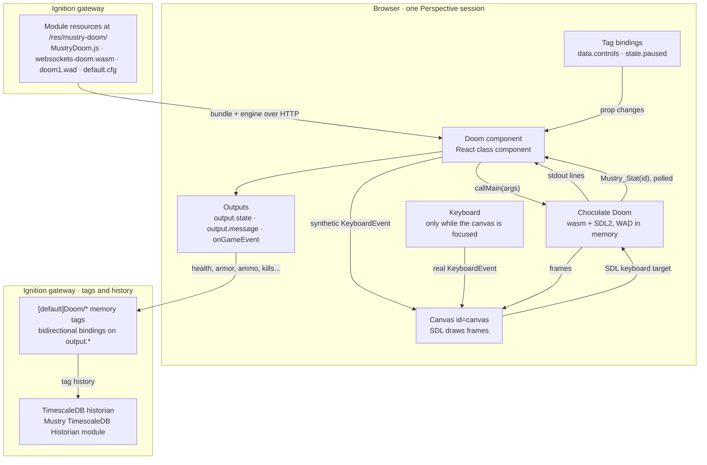

# Mustry Doom

An Ignition **8.3.6+** module that answers the question nobody in industrial
automation asked: can it run Doom? It adds one Perspective component, **Doom**,
which runs the 1993 shareware episode on a canvas inside your view. Controls
are tag-bindable, so a PLC input can fire the shotgun and an alarm can pause
the game.

It is free, GPL-2.0, and of no industrial value whatsoever.

- **Module ID:** `com.mustrysolutions.doom`
- **Component:** `mustrysolutions.perspective.fun.doom`, palette category `Mustry Solutions`
- **Engine:** [Chocolate Doom](https://www.chocolate-doom.org/) → WebAssembly via Cloudflare's [doom-wasm](https://github.com/cloudflare/doom-wasm); see [engine/](engine/README.md)

## Install

1. Download `Mustry-Doom.modl` from the releases page.
2. Gateway → Config → Modules → install. Accept the certificate and the licence.
3. In the Designer, drag **Doom** from the `Mustry Solutions` palette category into a view. Save. Open the session. Click to play.

The module is free: no trial, no activation.

## How it works



The gateway does almost nothing: the gateway hook mounts a static folder and
Perspective registers the component. Everything else happens in the browser
page.

1. **Start.** On click (or `config.autoStart`) the component injects the
   engine's script tag, calls the returned factory with its canvas, a file
   locator pointing back at the mount path, and a pre-run hook that fetches
   `doom1.wad` and `default.cfg` into the engine's in-memory filesystem. Then
   it calls `main` with a command line built from `config.*` (skill, warp
   target, sound, window size).
2. **SDL is the seam.** Chocolate Doom believes it draws to a window. SDL's
   Emscripten backend maps that window onto the canvas with id `canvas`, sizes
   the backing store from the canvas's CSS box times `devicePixelRatio`, and
   listens for keyboard events on that same canvas. The component only sets the
   canvas's CSS size to its frame and nudges SDL with a `resize` event when the
   frame changes.
3. **Tags become key presses.** A tag bound to `data.controls.fire` flips a
   prop; the component diffs old and new controls and dispatches a synthetic
   `KeyboardEvent` for Space at the canvas. SDL cannot tell it from a real key.
   Releasing the tag sends the key-up; `weapon` presses a digit; `state.paused`
   presses Doom's own Pause key.
4. **Telemetry comes out of the engine's memory.** A small C shim compiled
   into the engine (`Mustry_Stat(id)`, see `engine/patches`) reads the console
   player's health, armor, ammo, weapon, kill/item/secret counts, map and
   alive/dead state. The component polls it a few times a second and writes
   changed values to `output.*`. Bind those to memory tags and your historian
   records the marine like any process value.
5. **Information flows back through stdout.** The engine prints lines, some
   with a `doom: <code>, <text>` prefix. The component mirrors the last line
   into `output.message`, tracks the phase in `output.state`, fires
   `onGameEvent` for coded lines, and restores the tab title whenever SDL
   renames it.

Two guards: one engine per page (a second component reports `busy`), and on
unmount the component calls the engine's `I_Quit` so the main loop stops.

## The component

| Group | Prop | What |
|---|---|---|
| `config` | `autoStart` | Start on mount. Off (default) shows a "Click to play" splash, and that click also unlocks audio. |
| | `sound`, `music` | Sound effects (on) and OPL music (off, for the sake of your coworkers). |
| | `skill`, `warp`, `episode`, `map` | Difficulty 1–5 and where to start. The shareware IWAD only has episode 1. |
| | `keyboard` | Physical keyboard drives the game while the canvas is focused (click it). Keys never leak to the rest of the view. |
| | `mouse` | Mouse turn while focused. |
| | `pixelated`, `showHud`, `playLabel`, `extraArgs` | Crisp pixels, the status strip, the splash label, and raw engine arguments such as `-nomonsters`. |
| `data.controls` | `forward`, `backward`, `strafeLeft`, `strafeRight`, `turnLeft`, `turnRight`, `fire`, `use`, `run`, `menu`, `confirm` | Booleans: true holds the key down for as long as it stays true. Bind them to tags. |
| | `weapon` | Selects weapon slot 1–7 when the value changes; 0 = no change. |
| `state.paused` | | Two-way. True pauses the game (Doom's own pause). Bind it to an alarm. |
| `output.state` | | `idle`, `loading`, `running`, `paused`, `exited`, `error`, `busy` (another Doom already owns the page). |
| `output.message` | | The last line the engine printed. |
| event `onGameEvent` | `{ code, message }` | Engine lifecycle messages; `10` is "game started". |

### Live telemetry

While the game runs the component polls the engine a few times a second
(`config.statsIntervalMs`) and mirrors the marine into read-only outputs:
`output.health`, `armor`, `ammo`, `weapon`, `kills`, `items`, `secrets`, their
`total*` counterparts, `episode`, `map`, `levelSeconds`, `inLevel` and `dead`.
They are ordinary props, so they bind like anything else.

### Recipes

**Historize the marine.** Bind an output to a memory tag *bidirectionally*
(the component writes the prop, the binding pushes it to the tag), enable
history on the tag, and the marine's health is in your historian next to the
pump pressures. The verify project does exactly this into the Mustry
TimescaleDB Historian:

```json
"props.output.health": { "binding": { "type": "tag", "config": {
  "mode": "direct", "tagPath": "[default]Doom/Health", "bidirectional": true } } }
```

**Production stops, Doom stops.** Bind `state.paused` to an expression on a
line-status tag (or on an alarm's active count) and the game freezes with
Doom's own pause banner until the line runs again:

```
!{[default]Doom/Line/Running}
```

**A PLC input fires the shotgun.** Bind `data.controls.fire` to any boolean
tag. True holds the key down, false releases it. The same works for movement,
`use` (doors), `run` and `menu`; `data.controls.weapon` selects a slot on
change.

**Nightmare when the line runs hot.** `config.extraArgs` takes raw engine
arguments; a binding that yields `-fast -respawn` above a rate setpoint is
left as an exercise.

Key bindings (WASD move, arrows turn, Space fire, E use, Shift run, Esc menu)
live in the shipped `default.cfg` and are mirrored one-to-one by the tag
controls, so both ways of playing drive the same engine bindings.

One engine per browser page: a second Doom component on the same page reports
`busy`.

## Build

Requires Java 17. Node is downloaded by the build.

```bash
./gradlew build            # -> build/Mustry-Doom-<version>.modl (unsigned)
cd web && npm test         # jest, pure-logic suites
```

The compiled engine is committed, so the build never needs Emscripten. To
rebuild the engine from source (new upstream commit, new patch):

```bash
engine/build.sh            # Docker, emscripten/emsdk image
engine/build.sh --local    # or a local emsdk + automake/autoconf/pkg-config
```

## Dev gateway

```bash
ops/fresh.sh     # build, sign with a throwaway dev cert, recreate the gateway unattended
ops/deploy.sh    # rebuild + reload into the running gateway
ops/e2e.sh       # deploy + Playwright smoke test (--fresh recreates the gateway first, what CI runs)
ops/teardown.sh  # stop it (--purge to wipe the volume)
```

The smoke test in `e2e/` opens the verify project in headless Chromium, starts
the game, checks the engine sized its canvas and reports `running`, drives the
turn-left tag control and asserts the frame actually changed, and flips
`state.paused`. It fails on any console error.

The gateway comes up at http://localhost:9188 (admin / password) with a
`verify` project mounted from `ops/verify/project`. Open
http://localhost:9188/data/perspective/client/verify and click the game.

The compose file also starts TimescaleDB, and `ops/fresh.sh` seeds a
"Doom Historian" profile for the [Mustry TimescaleDB Historian](https://github.com/Mustry-Solutions/timescaledb-historian-module)
module. Stage that module once with `ops/stage-historian.sh` (it builds the
sibling repo dev-signed); the verify project's startup script then creates
historized `[default]Doom/*` tags and the view trends the marine's health.
Without the historian module staged, everything else still works; the tags
just have no history.

## Licensing

GPL-2.0-only for the module, because the engine is GPL-2.0. The shareware WAD
is id Software's and may only be redistributed complete and free of charge,
which is why this module can never be a paid product. Registered Doom, Doom II
and other IWADs are not included and must not be added for redistribution. See
[THIRD-PARTY-NOTICES.md](THIRD-PARTY-NOTICES.md).

DOOM is a trademark of id Software LLC. This project is not affiliated with id
Software, Bethesda, Cloudflare or Inductive Automation.
