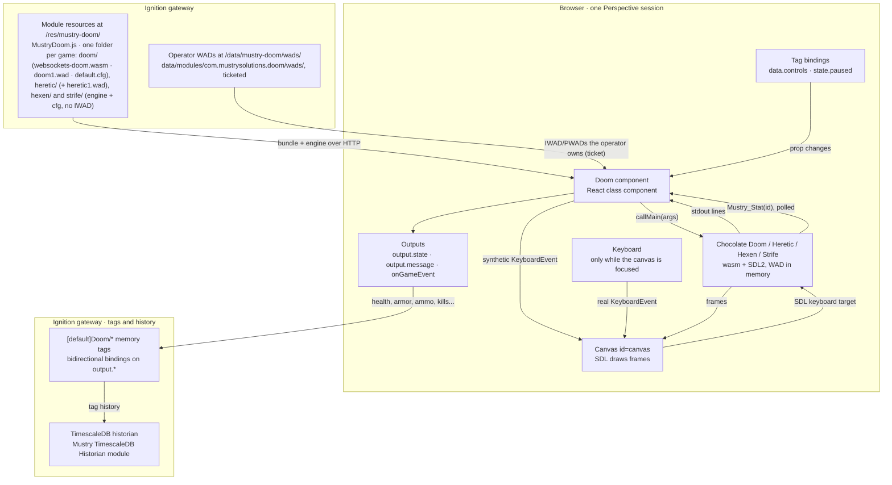

# Mustry Doom — reference

The engineering detail behind the [README](../README.md): architecture, every
prop, the four games, the tag model, building, the dev gateway and the tests.

## How it works



The gateway does little: the gateway hook mounts a static folder, serves
the operator's own WADs behind a ticket, relays deathmatch packets, keeps
save games and writes telemetry into a tag provider. The game itself runs
in the browser page.

1. **Start.** On click (or `config.autoStart`) the component looks up
   `config.game` in the `GAMES` table (`doomLogic.ts`: engine folder,
   bundled IWAD, config file, save layout, known IWAD names, netgame
   rules), injects that engine's script tag, calls the returned factory with
   its canvas and a file locator pointing back at the game's mount path, and
   a pre-run hook that fetches the bundled IWAD and cfg into the engine's
   in-memory filesystem, or the operator's WADs from the gateway when
   `config.iwad` (or the game) asks for them. Then it calls `main` with a
   command line built from `config.*` (skill, warp target, sound, window
   size, class, netgame).
2. **SDL is the seam.** Chocolate Doom believes it draws to a window. SDL's
   Emscripten backend maps that window onto the canvas with id `canvas`, sizes
   the backing store from the canvas's CSS box times `devicePixelRatio`, and
   listens for keyboard events on that same canvas. The component only sets the
   canvas's CSS size to its frame and nudges SDL with a `resize` event when the
   frame changes.
3. **Tags become key presses.** A tag bound to `data.controls.fire` flips a
   prop; the component diffs old and new controls and dispatches a synthetic
   `KeyboardEvent` for Space at the canvas. SDL cannot tell it from a real key.
   Releasing the tag sends the key-up; `weapon` presses a digit; `state.paused`
   presses Doom's own Pause key.
4. **Telemetry comes out of the engine's memory.** A small C shim compiled
   into the engine (`Mustry_Stat(id)`, see `engine/patches`) reads the console
   player's health, armor, ammo, weapon, kill/item/secret counts, map and
   alive/dead state. The component polls it a few times a second and writes
   changed values to `output.*`. Bind those to memory tags and your historian
   records the marine like any process value.
5. **Information flows back through stdout.** The engine prints lines, some
   with a `doom: <code>, <text>` prefix. The component mirrors the last line
   into `output.message`, tracks the phase in `output.state`, fires
   `onGameEvent` for coded lines, and restores the tab title whenever SDL
   renames it.

Two guards: one engine per page (a second component reports `busy`), and on
unmount the component calls the engine's `I_Quit` so the main loop stops.

## The component

| Group | Prop | What |
|---|---|---|
| `config` | `game` | `doom` (default) or `heretic`: which engine and shareware episode. Everything else in this table applies to both; the per-game facts (engine folder, bundled IWAD, config file, save file name, `-altdeath`, the shareware `-file` rule, episode range) live in `GAMES` in `doomLogic.ts`. |
| | `autoStart` | Start on mount. Off (default) shows a "Click to play" splash, and that click also unlocks audio. |
| | `sound`, `music` | Sound effects (on) and OPL music (off, for the sake of your coworkers). |
| | `iwad`, `pwads` | Play a WAD the gateway operator supplied instead of the shareware episode (see "Bring your own WAD"). Empty = shareware. |
| | `skill`, `warp`, `episode`, `map` | Difficulty 1–5 and where to start. The shareware IWAD only has episode 1; Ultimate Doom has 4; Doom II-style IWADs have no episodes and take `map` 1–32. |
| | `keyboard` | Physical keyboard drives the game while the canvas is focused (click it). Keys never leak to the rest of the view. |
| | `mouse` | Mouse turn while focused. |
| | `pixelated`, `showHud`, `playLabel`, `extraArgs` | Crisp pixels, the status strip, the splash label, and raw engine arguments such as `-nomonsters`. |
| `data.controls` | `forward`, `backward`, `strafeLeft`, `strafeRight`, `turnLeft`, `turnRight`, `fire`, `use`, `run`, `menu`, `confirm` | Booleans: true holds the key down for as long as it stays true. Bind them to tags. |
| | `weapon` | Selects weapon slot 1–7 when the value changes; 0 = no change. |
| `state.paused` | | Two-way. True pauses the game (Doom's own pause). Bind it to an alarm. |
| `state.running` | | Two-way. True starts the engine, false quits it; written back as the engine comes and goes, so a binding can restart the game without a reload. |
| `config.persistSaves` | | Keep Doom's six save slots on the gateway per Perspective user (default on). |
| `config.multiplayer`, `arena`, `players`, `deathmatch`, `relayUrl` | | Host or join a deathmatch through the gateway relay (see below). |
| `output.savedSlots`, `output.saveOwner`, `output.lastSaveSlot`, `output.lastSaveDescription` | | How many slots the gateway holds for this user, who that user is, and the most recent save made in this session. |
| `output.iwad`, `output.wadError`, `output.availableWads` | | The IWAD the engine actually runs, why `config.iwad`/`config.pwads` could not be honoured in full (empty when they could), and what the gateway's wads folder holds. |
| `output.state` | | `idle`, `loading`, `running`, `paused`, `exited`, `error`, `busy` (another Doom already owns the page). |
| `output.message` | | The last line the engine printed. |
| event `onGameEvent` | `{ code, message }` | Engine lifecycle messages; `10` is "game started". |

### Save games

Doom saves the way it always did: Escape, Save Game, pick a slot, type a name.
The engine writes the slot into its in-memory filesystem and calls a small hook
compiled into it; the component reads the file and sends it to the gateway
through Perspective's component-to-gateway message channel. A gateway-side
model delegate stores it under
`data/modules/com.mustrysolutions.doom/saves/<user>/slot<N>.dsg` (plus an
`index.json` with names and timestamps), keyed by the session's authenticated
user. An unauthenticated session has no owner: its saves stay in the tab
(the HUD says so) instead of landing in a folder every other anonymous visitor
would share. Before the engine starts, the component asks for the
user's slots and writes them back into the in-memory filesystem, so Doom's own
Load Game menu lists them. Slots are capped at 512 KB; a session can only ever
read or write its own user's folder. Turn it off with `config.persistSaves`.

### Heretic

`config.game = heretic` runs Chocolate Heretic, built from the same upstream
as the Doom engine (`engine/README.md`), with Raven's shareware episode City
of the Damned. Everything the component does for Doom it does for Heretic:
the same key table (`heretic.cfg` carries the scancodes of `default.cfg`),
tag-bound controls, telemetry through the same stat ids (Heretic's ammo is
the ready weapon's, `-1` for the staff and gauntlets), save games
(`hticsav<N>.hsg`, kept on the gateway under `saves/<user>/game-heretic1/`
so they never mix with Doom's), operator IWADs (`heretic.wad` in the wads
folder; Heretic does not refuse PWADs on shareware data) and deathmatch
through the same relay (Heretic has no `-altdeath`; that setting hosts a
plain deathmatch). The `[Doom]Players/<player>/Game` tag says which game a
player is in. The verify project has `/game/heretic` and the arena route
takes a fourth segment: `/arena/host/Corvus1/htic/heretic`.

### Hexen

`config.game = hexen` runs Chocolate Hexen from the same upstream, with one
difference from the other two: **the module ships no Hexen IWAD.** The
4-level demo's archive carries no redistribution grant (its README only says
"Hexen is NOT a shareware product"), so it stays out of the module and the
repo. Put `hexen.wad` (the demo's or the retail one) in the gateway's wads
folder and the component fetches it like any operator WAD (#2); without it
the component reports `Hexen cannot start without it` in `output.wadError`
and does not start. `config.playerClass` picks fighter, cleric or mage
(`-class`); `output.playerClass` and the `PlayerClass` tag report it.
Hexen's "ammo" is the ready weapon's mana, its "armor" is the status bar's
figure (class save plus the four pieces), and it has no kill/item/secret
totals.

Saves are the second difference: a Hexen slot is a folder, `hex<N>.hxs`
plus one `hex<N><map>.hxs` per visited map of the hub. The save protocol
carries a set of files (`files: [{name, data}]`) and the gateway keeps them
under `saves/<user>/game-hexen/slot<N>/`. Doom and Heretic still use one
file per slot; a slot is one or the other, never both.

Two engine facts the build patches (`engine/patches/0003`): Chocolate's
netgame handshake validates (mission, mode) against a table that only knows
Hexen as `commercial`, so the demo (`shareware`) could not host or join; the
demo is multiplayer capable, and the table gets a row for it (maps 1–4). And
the 640×480 graphical startup screen opens and destroys an SDL window of its
own, which on a canvas leaves the software renderer without a 2D context in
headless Chromium; it is off in this build.

Dev gateway: `ops/fetch-hexen-demo.sh` downloads the demo into
`engine/build/` (gitignored) and `ops/fresh.sh` seeds it into the wads
folder; CI does the same best-effort, and the Hexen e2e tests skip when it
is missing.

### Strife

`config.game = strife` runs Chocolate Strife, the last of the family, and
the one with no free data at all: Chocolate Strife does not support the
1996 demo (`strife0.wad` is disabled upstream with a `STRIFE-FIXME`), so
the module ships the engine only and the operator supplies `strife1.wad`
(the retail IWAD, also what Strife: Veteran Edition installs) in the wads
folder. `voices.wad` next to it gives the dialogue its speech; the
component fetches it as a *companion* (never passed with `-file`) and runs
with `-novoice` and text dialogue when it is missing. Netgames are always
deathmatch, as in vanilla. Telemetry adds `output.gold` and
`output.questFlags` (tags `Gold`, `QuestFlags`); Strife counts kills but has
no item/secret counters.

Saves are a folder per slot, `strfsav<N>.ssg/` with `name`, `mis_obj` and
one file per visited map, extension-less: the save protocol's file names may
carry one folder (`strfsav1.ssg/name`) and the component creates the seven
slot folders the engine expects before `main()`. The graphical intro is off
in this build (`engine/patches/0004`), for the same canvas reason as Hexen's
startup screen.

Dev gateway: copy your `strife1.wad` and `voices.wad` into
`engine/build/strife/` (gitignored); `ops/fresh.sh` seeds them and the two
Strife e2e tests run; without them they skip, as in CI.

### Freedoom and the PWAD path

The engine refuses `-file` on shareware Doom data, so until Freedoom the
suite could never load a PWAD. [Freedoom](https://freedoom.github.io/)
(BSD-3-Clause) is a complete free Doom: `freedoom1.wad` is episodic and
`freedoom2.wad` is `MAP01`-style, both names the engine knows, both treated
as registered games. `ops/fetch-freedoom.sh` downloads the pinned release
(SHA-256 from its signed CHECKSUM file) into `engine/build/` (gitignored,
~57 MB unpacked, never committed or shipped) and `seed_verify_wads` puts it
on the dev gateway with `ops/verify/wads/mustry-test.wad`, a 56-byte PWAD
of our own (`make-test-pwad.py`, one marker lump). The e2e test opens
`/wad/freedoom2/mustry-test` and requires the engine's stdout to say
`adding mustry-test.wad`: the whole operator-PWAD path (folder, ticketed
download, engine filesystem, `-file`, `W_AddFile`) in one assertion. CI
fetches Freedoom best-effort; the test skips without it.

### Bring your own WAD

The module ships the Doom and Heretic shareware episodes only and never will
ship more (see Licensing). It will, however, play what the gateway operator
owns, and for Hexen and Strife that is the only way to play at all: drop
IWADs and PWADs into `data/modules/com.mustrysolutions.doom/wads/` on the
gateway (the hook creates the folder at startup and logs its path) and name
them in `config.iwad` (one) and `config.pwads` (a list, loaded in order).
Names are case-insensitive and `.wad` is optional: `doom2` finds `DOOM2.WAD`.
No upload UI, no listing page: the operator copies files, the component asks
its own gateway delegate what is there.

Two engine facts shape this. Chocolate Doom identifies an IWAD by its **file
name** (`d_iwad.c`), so the operator's file must carry a canonical one:
`doom.wad`, `doom2.wad`, `plutonia.wad`, `tnt.wad`, `chex.wad`, `hacx.wad`,
`freedoom1.wad`, `freedoom2.wad`, `freedm.wad`; anything else is refused
before the download with `output.wadError`. And the engine refuses `-file`
with shareware data ("Register!"), so PWADs are skipped, and named in
`output.wadError`, whenever the IWAD in play is shareware. The component
reads the IWAD's lump directory to tell Doom II-style games (`MAP01`) from
episodic ones and passes `-warp` accordingly; `config.episode` is ignored
for Doom II.

Nothing here ever leaves the operator with a black canvas: an IWAD the
folder does not have falls back to shareware, a missing PWAD is skipped, and
`output.wadError` says which and why. A bound `config.iwad` that lands after
the engine started restarts it on the right game, the way a late netgame
binding does.

Downloads are not public. The page fetches
`/data/mustry-doom/wads/<name>` with a ticket its gateway delegate issued
(`X-Doom-Ticket`, the same registry as the relay's, revoked with the
delegate), so a registered IWAD dropped on the gateway is reachable by
Perspective sessions running the component and by nobody else who happens
to know the URL. Save games of a custom IWAD live in their own
`saves/<user>/game-<iwad>/` folder: a Doom II save loaded into shareware is
a crash, so slots never mix. Verified on the dev gateway with the shareware
data under the name `doom.wad` (`ops/lib.sh` seeds it for the e2e suite);
a registered IWAD with PWADs has not been exercised by the test suite.

### Deathmatch over the gateway

The engine's WebSockets netcode is compiled in, and the module mounts a relay
at `/system/doom-relay/<arena>` on the gateway. Set `config.multiplayer` to
`host` on one component and `join` on the others, same `config.arena`, and
the gateway becomes the Doom server's network: the host launches the game the
moment `config.players` marines are in the lobby. Rules come from the host's
`config.deathmatch` (coop, deathmatch, altdeath). The relay only looks at the
8-byte frame header (destination and source ids) and forwards; nothing about
the game is interpreted on the gateway.

A plain `GET /system/doom-relay/` (no WebSocket upgrade) returns the relay's
status as JSON: `{"arenas": [{"arena", "server", "peers"}], "count"}`. It is
unauthenticated like the relay path itself, so it names arenas and counts
peers but never players; the `[Doom]` tag provider has the per-player view.

The WebSocket upgrade through `WebResourceManager.addServlet` is verified on
8.3.6 only. [DivCurl/ignition-doom](https://github.com/DivCurl/ignition-doom)
found that on 8.3.1 Ignition hands the servlet an `HttpServletRequestWrapper`
that Jetty 12's upgrade refuses, and unwraps it in an overridden `service()`.
This module has no such workaround; if an older 8.3.x logs a failed upgrade
on `/system/doom-relay/`, that is the first thing to try.

The verify project has an arena page: open
`/data/perspective/client/verify/arena/host/Player1` in one browser and
`.../arena/join/Player2` in another (an optional third segment picks the
arena). Each marine's
telemetry lands in its own `[Doom]Players/<player>` folder, so the historian
records both sides of the fight.

### Live telemetry

While the game runs the component polls the engine a few times a second
(`config.statsIntervalMs`) and mirrors the marine into read-only outputs:
`output.health`, `armor`, `ammo`, `weapon`, `kills`, `items`, `secrets`, their
`total*` counterparts, `episode`, `map`, `levelSeconds`, `inLevel` and `dead`.
They are ordinary props, so they bind like anything else.

### Recipes

**Historize the marine.** The component already writes its telemetry into
the module's `[Doom]` provider. Enable history on `[Doom]Players/<player>/Health`
in the Designer, or mirror it with an expression tag the way the verify project does,
and the marine's health is in your historian next to the pump pressures. The
`output.*` props stay available for bindings on the view itself.

**Production stops, Doom stops.** Bind `state.paused` to an expression on a
line-status tag (or on an alarm's active count) and the game freezes with
Doom's own pause banner until the line runs again:

```
!{[default]Doom/Line/Running}
```

**A PLC input fires the shotgun.** Bind `data.controls.fire` to any boolean
tag. True holds the key down, false releases it. The same works for movement,
`use` (doors), `run` and `menu`; `data.controls.weapon` selects a slot on
change.

**Nightmare when the line runs hot.** `config.extraArgs` takes raw engine
arguments; a binding that yields `-fast -respawn` above a rate setpoint is
left as an exercise.

Key bindings (WASD move, arrows turn, Space fire, E use, Shift run, Esc menu)
live in the shipped `default.cfg` and are mirrored one-to-one by the tag
controls, so both ways of playing drive the same engine bindings.

One engine per browser page: a second Doom component on the same page reports
`busy`.

## Verify project

`ops/verify/project` is mounted into the dev gateway as project `verify`
(and packaged as the `DoomDemo` release asset). Its pages:

| Route | View | What |
|---|---|---|
| `/` | `Launcher` | One card per game with its pages. Doom and Heretic say SHIPS; Hexen and Strife say NEEDS YOUR WAD and link to their how-to. |
| `/doom`, `/heretic`, `/hexen`, `/strife` | `DoomHub`, `HereticHub`, `HexenHub`, `StrifeHub` | A game's overview: its pages with descriptions and routes, the engine/IWAD/tag facts, and for the data-less games a three-step how-to (get the WAD, put it on the gateway, play). |
| `/doom/control-room` | `DoomDemo` | The control room: tiles from the `[Doom]` provider, the line alarm, tag-bound controls, the historian trend. |
| `/arena/:role/:player[/:arena[/:game]]` | `DoomArena` | Deathmatch host or joiner. |
| `/wad/:iwad[/:pwad]`, `/game/:game` | `DoomWad` | Bring-your-own-WAD lab, or a game with its default IWAD (Hexen and Strife: the operator's `hexen.wad` / `strife1.wad`). |

The launcher and the hubs are generated: `ops/verify/tools/build_launcher.py`
holds the `GAMES` table (name, colour, tagline, sections with routes, and
for data-less games `needs_wad` and the `howto` steps); add a game or a
page there, run it, commit the JSON. Every game view's title is a link back
to `/`. The README's pictures come from `e2e/tests/screenshots.spec.ts`
(`SCREENSHOTS=1 npx playwright test screenshots` against a dev gateway with
the games seeded); rerun it after a visible change.

## Build

Requires Java 17. Node is downloaded by the build.

```bash
./gradlew build            # -> build/Mustry-Doom-<version>.modl (unsigned)
cd web && npm test         # jest, pure-logic suites
```

The compiled engines (all four) are committed, so the build never needs
Emscripten. The **Engines reproducible** workflow
(`.github/workflows/engines.yml`) rebuilds them in the emsdk image on every
change to `engine/` or the committed binaries, weekly, and on demand, and
fails if a byte differs: the committed engines are always what
`engine/build.sh` produces. The e2e job runs against the pinned Ignition
image and, informationally, against `inductiveautomation/ignition:latest`
(`IGNITION_IMAGE` in `docker-compose.yml`), so a Jetty or data-route change
in a new 8.3 shows up before anyone upgrades. To rebuild the engines from
source (new upstream commit, new patch):

```bash
engine/build.sh            # Docker, emscripten/emsdk image
engine/build.sh --local    # or a local emsdk + automake/autoconf/pkg-config
```

## Dev gateway

```bash
ops/fresh.sh            # build, sign with a throwaway dev cert, recreate the gateway unattended
ops/deploy.sh           # rebuild + reload into the running gateway
ops/e2e.sh              # deploy + Playwright suite (--fresh recreates the gateway first, what CI runs)
ops/teardown.sh         # stop it (--purge to wipe the volume)
ops/fetch-hexen-demo.sh # the Hexen 4-level demo -> engine/build/ (gitignored), seeded by fresh.sh
ops/fetch-freedoom.sh   # Freedoom 0.13.0 -> engine/build/ (gitignored), seeded by fresh.sh
```

`fresh.sh` also seeds `doom.wad` (the shareware data under a registered
name, for the bring-your-own-WAD tests), our own `mustry-test.wad`, and
whatever of the operator's data sits in `engine/build/strife/`. The suite
in `e2e/` opens the verify project in headless Chromium and, in 20 tests,
starts every game, drives the tag controls and the alarm pause, checks the
save-game paths, refuses a ticketless relay socket, plays a deathmatch per
game through the relay, exercises bring-your-own-WAD including a PWAD on
Freedoom, and walks the launcher. Tests whose data is missing skip. It
fails on any console error. `SCREENSHOTS=1 npx playwright test screenshots`
regenerates the README pictures instead.

The gateway comes up at http://localhost:9188 (admin / password) with a
`verify` project mounted from `ops/verify/project`. Open
http://localhost:9188/data/perspective/client/verify and click the game.
A second checkout (a worktree, say) can run its own gateway beside it by
overriding the container names and ports:

```bash
CONTAINER_NAME=mdoom-b TIMESCALE_CONTAINER_NAME=mdoom-b-db \
GATEWAY_HTTP_PORT=9288 GATEWAY_HTTPS_PORT=9243 TIMESCALE_PORT=5588 ops/fresh.sh
```

The compose file also starts TimescaleDB, and `ops/fresh.sh` seeds a
"Doom Historian" profile for the [Mustry TimescaleDB Historian](https://github.com/Mustry-Solutions/timescaledb-historian-module)
module. Two optional modules make the demo view complete; stage them once and
`fresh.sh` accepts them unattended next to Doom:

```bash
ops/stage-historian.sh   # builds the sibling historian repo, dev-signed
ops/stage-embr.sh        # downloads Musson Industrial's Embr Charts (MIT) release
```

The verify project's `doom.setupTags()` library script (run from the demo view's startup event) then builds the tag model below, and the
view trends the marine from the historian with Embr's Chart.js component (a
tag-history binding per dataset with a script transform to `{x, y}` points;
the chart is bound to `Player1` because tag-history bindings do not take the
view's `{view.params.player}` indirection, unlike the tag bindings on the KPI
tiles and the component outputs).
Without them everything else still works: the tags have no history and the
chart shows an "unknown component" placeholder.

### Tag model (multiplayer-ready)

| Path | What |
|---|---|
| `[Doom]Players/<player>/*` | The module's **own tag provider**. The component streams its telemetry to the gateway and the module writes Health, Armor, Ammo, Weapon, Kills, Items, Secrets, their totals, Episode, Map, LevelSeconds, InLevel, Dead, plus Online, Session and LastSeen. No bindings, no scripts: drop the component on any view and the folder appears. `config.player` names the folder (default: the session's user, else `anonymous-<session>`). Tags are customisable in the Designer (history, alarms). |
| `[default]Doom/Players/<player>/*` | The plant-side mirror: expression tags onto `[Doom]Players/<player>/...` adding what a plant wants on top, history to the TimescaleDB profile, the "Marine down" alarm (Critical), documentation. Built per player by `doom.setupPlayer(name)` from the view's `player` param, so a second player is a second session with another param and the folder appears by itself. (Not a UDT: parameter substitution in types created through `system.tag.configure` did not resolve on 8.3.6.) |
| `[default]Doom/Line/Running` | Pretend production line with the "Line stopped" alarm (High). |

`state.paused` is a tag binding on `[default]Doom/Line/Running.AlarmActiveUnackCount`
with a `> 0` transform: an active, unacknowledged line alarm pauses the game;
acknowledging it in the alarm status table, or restarting the line, resumes it.
(Two things learned the hard way: in 8.3 bindings the property is
`AlarmActiveUnackCount`, not the documented `ActiveUnackCount`; and it must be a
*tag* binding on the property, because an expression that merely references it
re-evaluates on the tag's value change, before the alarm has transitioned.)

## Licensing

GPL-2.0-only for the module, because the engines are GPL-2.0. The Doom
shareware WAD is id Software's and may only be redistributed complete and free
of charge; the Heretic shareware WAD is Raven's under id's Limited Use licence
(electronic distribution in compressed form, no commercial use), which is why
this module can never be a paid product. Registered Doom, Doom II, Heretic,
Hexen, Strife and other IWADs are not included and must not be added for
redistribution: Hexen and Strife ship as engines only, for the data the
operator owns. See [THIRD-PARTY-NOTICES.md](../THIRD-PARTY-NOTICES.md).

DOOM is a trademark of id Software LLC; Heretic and Hexen of Raven Software /
id Software; Strife of Rogue Entertainment / Night Dive Studios. This
project is not affiliated with id Software, Raven Software, Rogue,
Bethesda, Cloudflare or Inductive Automation.
