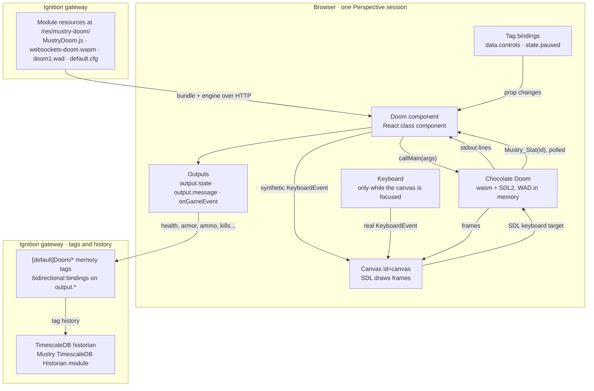

# Mustry Doom — reference

The engineering detail behind the [README](../README.md): architecture, every
prop, the tag model, building, the dev gateway and the tests.

## How it works



The gateway does almost nothing: the gateway hook mounts a static folder and
Perspective registers the component. Everything else happens in the browser
page.

1. **Start.** On click (or `config.autoStart`) the component injects the
   engine's script tag, calls the returned factory with its canvas, a file
   locator pointing back at the mount path, and a pre-run hook that fetches
   `doom1.wad` and `default.cfg` into the engine's in-memory filesystem. Then
   it calls `main` with a command line built from `config.*` (skill, warp
   target, sound, window size).
2. **SDL is the seam.** Chocolate Doom believes it draws to a window. SDL's
   Emscripten backend maps that window onto the canvas with id `canvas`, sizes
   the backing store from the canvas's CSS box times `devicePixelRatio`, and
   listens for keyboard events on that same canvas. The component only sets the
   canvas's CSS size to its frame and nudges SDL with a `resize` event when the
   frame changes.
3. **Tags become key presses.** A tag bound to `data.controls.fire` flips a
   prop; the component diffs old and new controls and dispatches a synthetic
   `KeyboardEvent` for Space at the canvas. SDL cannot tell it from a real key.
   Releasing the tag sends the key-up; `weapon` presses a digit; `state.paused`
   presses Doom's own Pause key.
4. **Telemetry comes out of the engine's memory.** A small C shim compiled
   into the engine (`Mustry_Stat(id)`, see `engine/patches`) reads the console
   player's health, armor, ammo, weapon, kill/item/secret counts, map and
   alive/dead state. The component polls it a few times a second and writes
   changed values to `output.*`. Bind those to memory tags and your historian
   records the marine like any process value.
5. **Information flows back through stdout.** The engine prints lines, some
   with a `doom: <code>, <text>` prefix. The component mirrors the last line
   into `output.message`, tracks the phase in `output.state`, fires
   `onGameEvent` for coded lines, and restores the tab title whenever SDL
   renames it.

Two guards: one engine per page (a second component reports `busy`), and on
unmount the component calls the engine's `I_Quit` so the main loop stops.

## The component

| Group | Prop | What |
|---|---|---|
| `config` | `autoStart` | Start on mount. Off (default) shows a "Click to play" splash, and that click also unlocks audio. |
| | `sound`, `music` | Sound effects (on) and OPL music (off, for the sake of your coworkers). |
| | `skill`, `warp`, `episode`, `map` | Difficulty 1–5 and where to start. The shareware IWAD only has episode 1. |
| | `keyboard` | Physical keyboard drives the game while the canvas is focused (click it). Keys never leak to the rest of the view. |
| | `mouse` | Mouse turn while focused. |
| | `pixelated`, `showHud`, `playLabel`, `extraArgs` | Crisp pixels, the status strip, the splash label, and raw engine arguments such as `-nomonsters`. |
| `data.controls` | `forward`, `backward`, `strafeLeft`, `strafeRight`, `turnLeft`, `turnRight`, `fire`, `use`, `run`, `menu`, `confirm` | Booleans: true holds the key down for as long as it stays true. Bind them to tags. |
| | `weapon` | Selects weapon slot 1–7 when the value changes; 0 = no change. |
| `state.paused` | | Two-way. True pauses the game (Doom's own pause). Bind it to an alarm. |
| `state.running` | | Two-way. True starts the engine, false quits it; written back as the engine comes and goes, so a binding can restart the game without a reload. |
| `config.persistSaves` | | Keep Doom's six save slots on the gateway per Perspective user (default on). |
| `config.multiplayer`, `arena`, `players`, `deathmatch`, `relayUrl` | | Host or join a deathmatch through the gateway relay (see below). |
| `output.savedSlots`, `output.saveOwner`, `output.lastSaveSlot`, `output.lastSaveDescription` | | How many slots the gateway holds for this user, who that user is, and the most recent save made in this session. |
| `output.state` | | `idle`, `loading`, `running`, `paused`, `exited`, `error`, `busy` (another Doom already owns the page). |
| `output.message` | | The last line the engine printed. |
| event `onGameEvent` | `{ code, message }` | Engine lifecycle messages; `10` is "game started". |

### Save games

Doom saves the way it always did: Escape, Save Game, pick a slot, type a name.
The engine writes the slot into its in-memory filesystem and calls a small hook
compiled into it; the component reads the file and sends it to the gateway
through Perspective's component-to-gateway message channel. A gateway-side
model delegate stores it under
`data/modules/com.mustrysolutions.doom/saves/<user>/slot<N>.dsg` (plus an
`index.json` with names and timestamps), keyed by the session's authenticated
user, or `anonymous`. Before the engine starts, the component asks for the
user's slots and writes them back into the in-memory filesystem, so Doom's own
Load Game menu lists them. Slots are capped at 512 KB; a session can only ever
read or write its own user's folder. Turn it off with `config.persistSaves`.

### Deathmatch over the gateway

The engine's WebSockets netcode is compiled in, and the module mounts a relay
at `/system/doom-relay/<arena>` on the gateway. Set `config.multiplayer` to
`host` on one component and `join` on the others, same `config.arena`, and
the gateway becomes the Doom server's network: the host launches the game the
moment `config.players` marines are in the lobby. Rules come from the host's
`config.deathmatch` (coop, deathmatch, altdeath). The relay only looks at the
8-byte frame header (destination and source ids) and forwards; nothing about
the game is interpreted on the gateway.

The verify project has an arena page: open
`/data/perspective/client/verify/arena/host/Player1` in one browser and
`.../arena/join/Player2` in another (an optional third segment picks the
arena). Each marine's
telemetry lands in its own `[Doom]Players/<player>` folder, so the historian
records both sides of the fight.

### Live telemetry

While the game runs the component polls the engine a few times a second
(`config.statsIntervalMs`) and mirrors the marine into read-only outputs:
`output.health`, `armor`, `ammo`, `weapon`, `kills`, `items`, `secrets`, their
`total*` counterparts, `episode`, `map`, `levelSeconds`, `inLevel` and `dead`.
They are ordinary props, so they bind like anything else.

### Recipes

**Historize the marine.** The component already writes its telemetry into
the module's `[Doom]` provider. Enable history on `[Doom]Players/<player>/Health`
in the Designer, or mirror it with an expression tag the way the verify project does,
and the marine's health is in your historian next to the pump pressures. The
`output.*` props stay available for bindings on the view itself.

**Production stops, Doom stops.** Bind `state.paused` to an expression on a
line-status tag (or on an alarm's active count) and the game freezes with
Doom's own pause banner until the line runs again:

```
!{[default]Doom/Line/Running}
```

**A PLC input fires the shotgun.** Bind `data.controls.fire` to any boolean
tag. True holds the key down, false releases it. The same works for movement,
`use` (doors), `run` and `menu`; `data.controls.weapon` selects a slot on
change.

**Nightmare when the line runs hot.** `config.extraArgs` takes raw engine
arguments; a binding that yields `-fast -respawn` above a rate setpoint is
left as an exercise.

Key bindings (WASD move, arrows turn, Space fire, E use, Shift run, Esc menu)
live in the shipped `default.cfg` and are mirrored one-to-one by the tag
controls, so both ways of playing drive the same engine bindings.

One engine per browser page: a second Doom component on the same page reports
`busy`.

## Build

Requires Java 17. Node is downloaded by the build.

```bash
./gradlew build            # -> build/Mustry-Doom-<version>.modl (unsigned)
cd web && npm test         # jest, pure-logic suites
```

The compiled engine is committed, so the build never needs Emscripten. To
rebuild the engine from source (new upstream commit, new patch):

```bash
engine/build.sh            # Docker, emscripten/emsdk image
engine/build.sh --local    # or a local emsdk + automake/autoconf/pkg-config
```

## Dev gateway

```bash
ops/fresh.sh     # build, sign with a throwaway dev cert, recreate the gateway unattended
ops/deploy.sh    # rebuild + reload into the running gateway
ops/e2e.sh       # deploy + Playwright smoke test (--fresh recreates the gateway first, what CI runs)
ops/teardown.sh  # stop it (--purge to wipe the volume)
```

The smoke test in `e2e/` opens the verify project in headless Chromium, starts
the game, checks the engine sized its canvas and reports `running`, drives the
turn-left tag control and asserts the frame actually changed, and flips
`state.paused`. It fails on any console error.

The gateway comes up at http://localhost:9188 (admin / password) with a
`verify` project mounted from `ops/verify/project`. Open
http://localhost:9188/data/perspective/client/verify and click the game.

The compose file also starts TimescaleDB, and `ops/fresh.sh` seeds a
"Doom Historian" profile for the [Mustry TimescaleDB Historian](https://github.com/Mustry-Solutions/timescaledb-historian-module)
module. Two optional modules make the demo view complete; stage them once and
`fresh.sh` accepts them unattended next to Doom:

```bash
ops/stage-historian.sh   # builds the sibling historian repo, dev-signed
ops/stage-embr.sh        # downloads Musson Industrial's Embr Charts (MIT) release
```

The verify project's `doom.setupTags()` library script (run from the demo view's startup event) then builds the tag model below, and the
view trends the marine from the historian with Embr's Chart.js component (a
tag-history binding per dataset with a script transform to `{x, y}` points;
the chart is bound to `Player1` because tag-history bindings do not take the
view's `{view.params.player}` indirection, unlike the tag bindings on the KPI
tiles and the component outputs).
Without them everything else still works: the tags have no history and the
chart shows an "unknown component" placeholder.

### Tag model (multiplayer-ready)

| Path | What |
|---|---|
| `[Doom]Players/<player>/*` | The module's **own tag provider**. The component streams its telemetry to the gateway and the module writes Health, Armor, Ammo, Weapon, Kills, Items, Secrets, their totals, Episode, Map, LevelSeconds, InLevel, Dead, plus Online, Session and LastSeen. No bindings, no scripts: drop the component on any view and the folder appears. `config.player` names the folder (default: the session's user, else `anonymous-<session>`). Tags are customisable in the Designer (history, alarms). |
| `[default]Doom/Players/<player>/*` | The plant-side mirror: expression tags onto `[Doom]Players/<player>/...` adding what a plant wants on top, history to the TimescaleDB profile, the "Marine down" alarm (Critical), documentation. Built per player by `doom.setupPlayer(name)` from the view's `player` param, so a second player is a second session with another param and the folder appears by itself. (Not a UDT: parameter substitution in types created through `system.tag.configure` did not resolve on 8.3.6.) |
| `[default]Doom/Line/Running` | Pretend production line with the "Line stopped" alarm (High). |

`state.paused` is a tag binding on `[default]Doom/Line/Running.AlarmActiveUnackCount`
with a `> 0` transform: an active, unacknowledged line alarm pauses the game;
acknowledging it in the alarm status table, or restarting the line, resumes it.
(Two things learned the hard way: in 8.3 bindings the property is
`AlarmActiveUnackCount`, not the documented `ActiveUnackCount`; and it must be a
*tag* binding on the property, because an expression that merely references it
re-evaluates on the tag's value change, before the alarm has transitioned.)

## Licensing

GPL-2.0-only for the module, because the engine is GPL-2.0. The shareware WAD
is id Software's and may only be redistributed complete and free of charge,
which is why this module can never be a paid product. Registered Doom, Doom II
and other IWADs are not included and must not be added for redistribution. See
[THIRD-PARTY-NOTICES.md](../THIRD-PARTY-NOTICES.md).

DOOM is a trademark of id Software LLC. This project is not affiliated with id
Software, Bethesda, Cloudflare or Inductive Automation.
